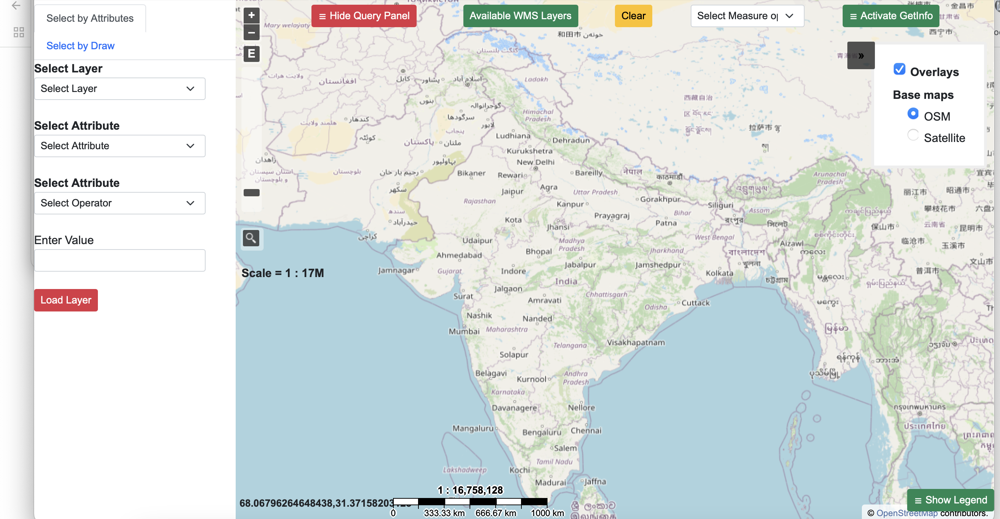

# gis-project-template

Template for GIS projects with data, code, and documentation.
Global Airports WebGIS with Administrative Boundaries of Pakistan for Disaster Response in Pakistan

Overview

This WebGIS application displays all airports across the world along with administrative boundaries of Pakistan. It allows users to:

    •	Locate the closest airport from any location worldwide, with a special focus on Pakistan.
    •	Access airport services and information.
    •	Perform geoprocessing operations (e.g., draw circles, measure distances, lines, polygons etc.).
    •	Query and visualize data using WMS and WFS services from GeoServer.

The project integrates Bootstrap, Python, GeoServer, PostGIS, QGIS, PHP, JavaScript, HTML, CSS, and Postgres-PostGIS for both the backend and frontend.

Features

    •	Display Global Airports: View all airports on the map with interactive markers.
    •	Administrative Boundaries of Pakistan: Provincial and district-level boundaries.
    •	Closest Airport Calculation: Find the nearest airport from any selected point.
    •	Geoprocessing Tools:
    •	Draw circles to analyze areas.
    •	Measure distances to airports.
    •	WMS/WFS Services: Use GeoServer to access spatial layers.
    •	Database Management: PostGIS integration with QGIS for data import/export.

    Technologies Used

    •	Frontend: Bootstrap, HTML, CSS, JavaScript
    •	Backend: Python, PHP
    •	Database: PostgreSQL with PostGIS extension
    •	Mapping & GeoServer:
    •	QGIS for visualizing and managing spatial data
    •	GeoServer for publishing WMS/WFS services

Setup Instructions

1. Install Required Tools

   • PostgreSQL with PostGIS extension
   • QGIS
   • GeoServer
   • Python (for backend scripts)
   • PHP (if required for API endpoints)

   Database Setup

   Create a new PostGIS database.
   CREATE DATABASE airports_db;
   CREATE EXTENSION postgis;

2. Import the airports dataset and Pakistan administrative boundaries into the PostGIS database using QGIS or psql.

3. Publish Layers to GeoServer

   • Connect GeoServer to the PostGIS database.
   • Publish WMS and WFS services for both the airport and boundary layers.

4. Run the WebGIS Application

   Start GeoServer:
   • Access it at http://localhost:8080/geoserver.
   Load the index.html in your browser:
   • http://localhost/index.html

   ## Screenshot

